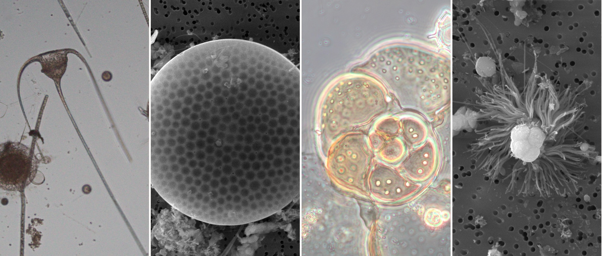
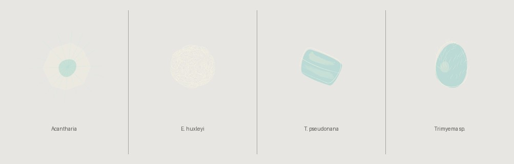

---
format:
  html:
    toc: false
editor: source
---

::: hero-kicker
Marine microbial eukaryote ecology
:::

::: hero-statement
We study the microbial eukaryotes that run the ocean's carbon and nutrient cycles.
:::

::: hero-lead
The Hu lab studies marine microeukaryotes or protists in a range of ecosystems, including the coast, oligotrophic ocean, sediment, and deep-sea hydrothermal vents at the seafloor. Department of Oceanography, Texas A&M University.
:::

{.banner fig-alt="Light micrograph and scanning electron microscope images of marine protists."}

## Central questions

Protistan species make up the majority of branches on the eukaryotic tree of life, and their nutritional strategies are as varied as their morphology. That variety puts them at the center of marine food webs, where they mediate central routes of energy and nutrient flux. Every project in the lab starts from the same three questions.

:::::: question-list
::: q
[01]{.q-num}

### Who is present?

Amplicon surveys and reference databases resolve which microeukaryotes occupy a habitat — including the deep-sea taxa that most reference databases still miss.
:::

::: q
[02]{.q-num}

### What are they doing?

Metatranscriptomics and grazing experiments distinguish phototrophy, heterotrophy, and mixotrophy *in situ*, rather than inferring metabolism from taxonomy alone.
:::

::: q
[03]{.q-num}

### What is their ecological role?

Grazing rates and biomass estimates place protists in the carbon budget of the ecosystems they inhabit, from the oxycline to diffuse vent fluid.
:::
::::::

## Where we work

:::::::: sitelist
::: site
[2022 · 2023]{.site-when}

**Axial Seamount** · Juan de Fuca Ridge, NE Pacific

[An active submarine volcano off the Oregon coast. Diffuse vent fields inside the caldera span a range of distinct geochemistries.]{.site-note}
:::

::: site
[2020]{.site-when}

**Mid-Cayman Rise** · Von Damm & Piccard, Caribbean

[Nine ROV *Jason* dives from RV *Atlantis*, including grazing incubations held at *in situ* pressure.]{.site-note}
:::

::: site
[2019]{.site-when}

**Gorda Ridge** · Sea Cliff & Apollo, NE Pacific

[E/V *Nautilus* with ROV *Hercules*, as part of the SUBSEA ocean-worlds analog program.]{.site-note}
:::

::: site
[2023 - present]{.site-when}

**Gulf of Mexico** · Gulf Coast to offshore

[Annual student training cruises to the Northern Gulf of Mexico.]{.site-note}
:::

::: site
[monthly, 15+ years]{.site-when}

**San Pedro Ocean Time-series** · Southern California

[Surface to 880 m, sampled monthly — long enough to resolve seasonal and annual community turnover.]{.site-note}
:::

::: site
[30+ years]{.site-when}

**Station ALOHA** · North Pacific Subtropical Gyre

[Hawaii Ocean Time-series, plus diel sampling every 4 hours following a single parcel of water.]{.site-note}
:::
::::::::

[All publications →](publications.qmd){.more}

:::::: {.topic-grid .topic-grid-footer}
::: topic
### Research

Deep-sea hydrothermal vents, ocean time-series, and the computational tools we build to work with eukaryotic sequence data.

[Research →](research.qmd){.more}
:::

::: topic
### People

Graduate students, undergraduate researchers, and alumni, plus how to join the lab.

[People →](team.qmd){.more}
:::

::: topic
### Lab community

How we work together: expectations, mentoring, code club, and onboarding.

[Lab community →](lab-policies.qmd){.more}
:::
::::::

{.footer-banner fig-alt="Four line illustrations from the lab: Acantharia, Emiliania huxleyi, Thalassiosira pseudonana, and Trimyema sp."}
