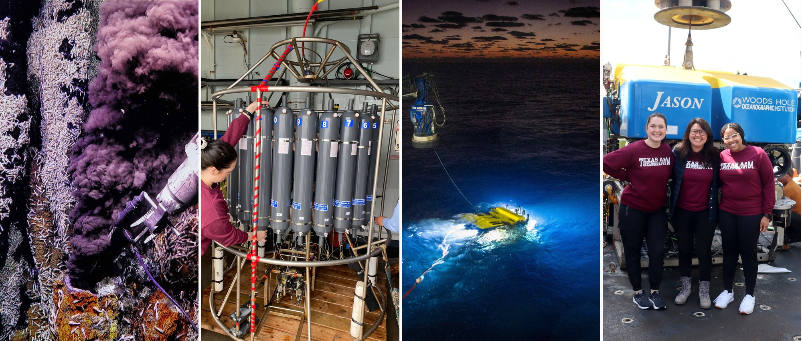
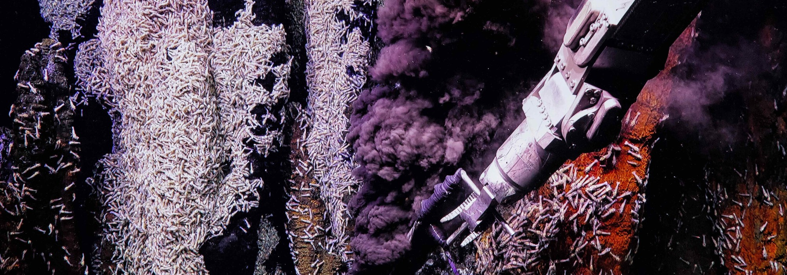
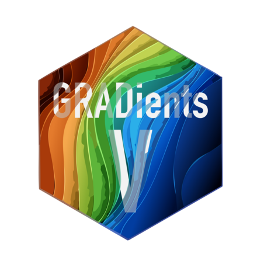
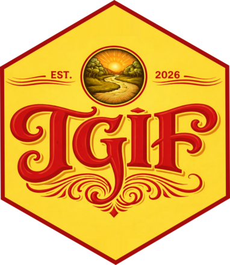
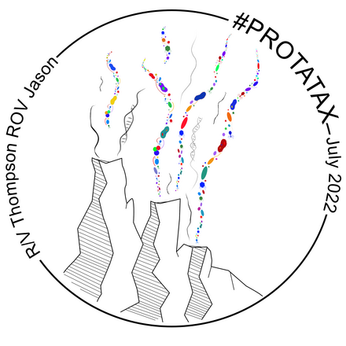
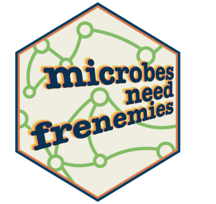
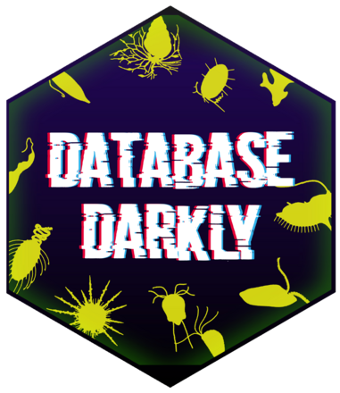
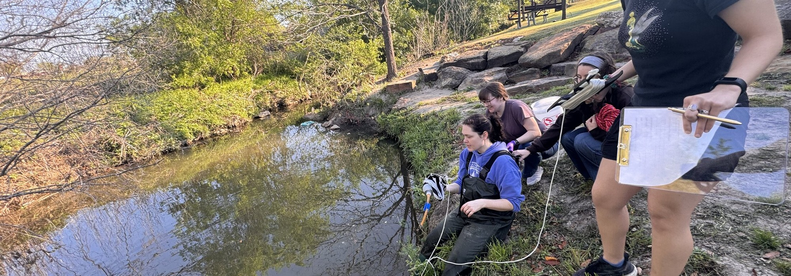
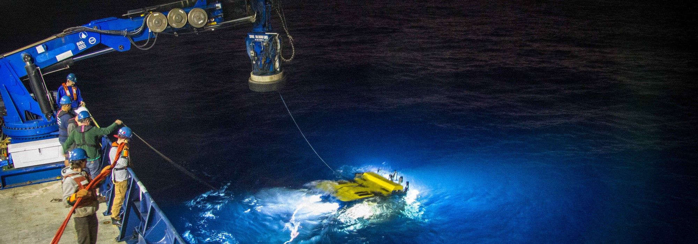
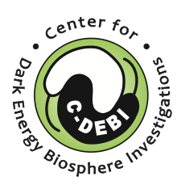

Protists sit at the center of marine food webs as primary producers, consumers, mixotrophs, and partners in mutualistic or parasitic associations. Our work spans three connected lines: what protists do at deep-sea hydrothermal vents, how their communities change over time in the water column, and the computational infrastructure needed to answer either question at scale.

{.banner fig-alt="Black smoker vent with a fluid sampler, a CTD rosette on deck, an ROV deployment at dusk, and lab members in front of ROV Jason."}

## Research areas

::::::::: topic-grid
::: topic
### Deep-sea vents

Heterotrophic protists transfer organic carbon from chemosynthetic primary producers to higher trophic levels. We quantify grazing pressure and community composition in diffuse vent fluid, the plume, and background deep-sea water.

[Deep-sea vents →](deepsea-vents.qmd){.more}
:::

::: topic
### Time-series

Monthly and diel sampling at the San Pedro Ocean Time-series and Station ALOHA resolves how microeukaryotic diversity and metabolic activity shift with season, depth, and time of day.

[Time-series →](time-series.qmd){.more}
:::

::: topic
### Data science

Reproducible pipelines for tag-sequencing and metatranscriptomics, tools for annotating eukaryotic meta'omic data, and tutorials for students and collaborators.

[Data science →](data-science.qmd){.more}
:::

::: topic
### Protistan predators

Heterotrophic protists consume bacteria and archaea, and that grazing is a measurable flux. We quantify predation pressure and cell abundance, including incubations held at *in situ* pressure.

[How we measure it →](deepsea-vents.qmd#accessing-deep-sea-food-webs){.more}
:::

::: topic
### Microbial food web

Grazing is one route to microbial mortality; viral lysis is another. We ask how the balance between them shifts across habitats, and what that means for carbon transfer.

[Food web interactions →](deepsea-vents.qmd#microbes-need-frenemies){.more}
:::

::: topic
### Gulf of Mexico {#gulf-of-mexico}

An 18S survey from the Louisiana coast to the offshore Northern Gulf, surface to over 2,000 m, testing how riverine input and Loop Current eddies structure protistan communities.

[Gulf of Mexico →](#gulf-of-mexico){.more}
:::
:::::::::

{.figure-wide}

## Projects

Current and recent work, most active first.

:::::::::::: project-grid
::: project
{.project-logo fig-alt="GRADients hex logo"}

[Northern Gulf · 12 stations · surface to \>2,000 m]{.project-meta}

### Gulf of Mexico

*Riverine input and eddy edge effects on microeukaryotic biodiversity in the Northern Gulf.* An 18S rRNA gene metabarcoding survey from the Louisiana coast to the offshore Northern Gulf. Water masses, the DIC-to-total-alkalinity ratio, distance to the coast, and depth together structure protistan composition, with a secondary signal at the edge of a Loop Current eddy. Diatoms dominate the upper water column at the Mississippi River–Gulf interface; dinoflagellates, parasitic Syndiniales, and rhizaria make up the offshore communities. Manuscript in preparation.

[Data dashboard →](https://msonsel.shinyapps.io/microbial_app/){.more} [Amplicon workflow →](https://shu251.github.io/Gulf-2023-amplicons/GoM-2023-amplicons.html){.more}
:::

::: project
[Grazing experiments + metatranscriptomics]{.project-meta}

### Protistan heterotrophy: phenotype to genotype

Consumption is a phenotype we can measure; gene expression is what we can sequence. This work pairs grazing rate experiments with metatranscriptomics so a measured feeding rate can be tied to the transcripts of the taxa responsible, rather than inferring metabolism from taxonomy alone.

[Metatranscriptomics tutorial →](https://shu251.github.io/meta-eukomic/main.html){.more}
:::

::: project
{.project-logo fig-alt="TGIF hex logo"}

[TAMU Gardens · White Creek · undergraduate-led]{.project-meta}

### TGIF — TAMU Gardens in Focus

A freshwater counterpart to the lab's marine work, run on campus. Undergraduate researchers sample White Creek at the TAMU Gardens, image plankton with a PlanktoScope, and pull rainfall, air temperature, and wind from the adjacent campus weather station. The goal is an R pipeline that ingests the environmental data and keeps a public site current.

[Garden dashboard →](https://shu251.github.io/tamu-gardens-in-focus/garden-dashboard.html){.more}
:::

::: project
{.project-logo fig-alt="PROTATAX expedition logo"}

[NSF OCE-1947776 · Axial Seamount 2022, 2023]{.project-meta}

### Phagotrophic protists at hot spots of primary production

Characterizing and quantifying the impact of phagotrophic protists at Axial Seamount, an active submarine volcano on the Juan de Fuca Ridge. Grazing incubations with diffuse vent fluid resolve the rate and route of carbon through protistan grazers.

[Deep-sea vents →](deepsea-vents.qmd){.more}
:::

::: project
{.project-logo fig-alt="Microbes need frenemies hex logo"}

[NSF · with Rika Anderson (Carleton) & Julie Huber (WHOI)]{.project-meta}

### Trophic interactions among microbial eukaryotes, viruses, and prokaryotes

Identifying the interactions that end in cell death — protistan grazing and viral lysis — and asking how their balance shifts across vent habitats. Outcomes include new microbiology, oceanography, and computer science curricula for community college students.

[Project record →](https://www.bco-dmo.org/project/875053){.more}
:::

::: project
[C-DEBI · Gorda Ridge, Mid-Cayman Rise, Axial Seamount]{.project-meta}

### Biogeography of deep-sea vent microeukaryotes

An 18S rRNA gene survey testing how distinct protistan populations are in vent fluids meters apart versus oceans apart. Species richness was consistently higher in diffuse vent fluid than in the plume or background, and populations at individual sites were largely distinct.

[Molecular Ecology 2022 →](https://doi.org/10.1111/mec.16745){.more}
:::

::: project
{.project-logo fig-alt="Database Darkly hex logo"}

[Undergraduate-led]{.project-meta}

### Database Darkly

Deep-sea biodiversity work is limited by incomplete genetic reference databases. A team of undergraduate researchers mined biological and ecological information about the protistan species recovered in our tag-sequencing surveys.

[Database Darkly →](https://shu251.github.io/deep-sea-microeuk-DB/){.more}
:::

::: project
[OCB-funded intercalibration]{.project-meta}

### Metaeukomic

A community-wide effort to measure how much variability metatranscriptome results inherit from bench and computational pipeline choices. Lab members contribute samples and analyses.

[Metaeukomic →](https://www.us-ocb.org/metat-intercomparison/){.more}
:::

::: project
[SPOT · Station ALOHA]{.project-meta}

### Ocean time-series

Monthly sampling at the San Pedro Ocean Time-series and diel sampling at Station ALOHA, resolving how microeukaryotic diversity and metabolic activity shift with season, depth, and time of day.

[Time-series →](time-series.qmd){.more}
:::
::::::::::::

{.figure-wide}

<!-- To add a project, copy one ::: project block. Order is top-to-bottom as written. -->

## How we work

:::::: question-list
::: q
[01]{.q-num}

### Field collection

Diffuse vent fluid via ROV, CTD-rosette casts through the water column, and shipboard incubations. Some grazing experiments are held at *in situ* pressure, which changes the answer: cell abundances and grazing rates measured under pressure exceed those measured at 1 atm.
:::

::: q
[02]{.q-num}

### Sequencing

18S rRNA gene tag-sequencing to resolve who is present; metatranscriptomics to resolve what they are doing. Reference database completeness limits both, which is why we work on the databases too.
:::

::: q
[03]{.q-num}

### Reproducible analysis

Snakemake and QIIME2 workflows, tools for annotating eukaryotic meta'omic data, and tutorials written so students and collaborators can run the same pipeline on their own data.
:::
::::::

{.figure-wide}

## Support

Work in the lab has been supported by the [National Science Foundation](https://www.nsf.gov), the [Center for Dark Energy Biosphere Investigations (C-DEBI)](https://www.darkenergybiosphere.org/), the [Simons Foundation](https://www.simonsfoundation.org), and [Ocean Carbon & Biogeochemistry (OCB)](https://www.us-ocb.org/).

::: funder-row
{fig-alt="National Science Foundation"} {fig-alt="Center for Dark Energy Biosphere Investigations"} {fig-alt="Woods Hole Oceanographic Institution"}

{fig-alt="Texas A&M University Department of Oceanography"}
:::

See [publications](publications.qmd) for peer-reviewed output, and [github.com/shu251](https://github.com/shu251) for code in progress.
