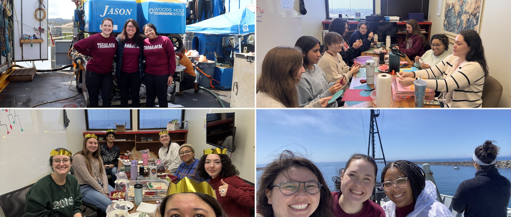
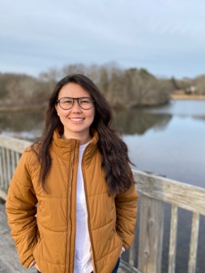
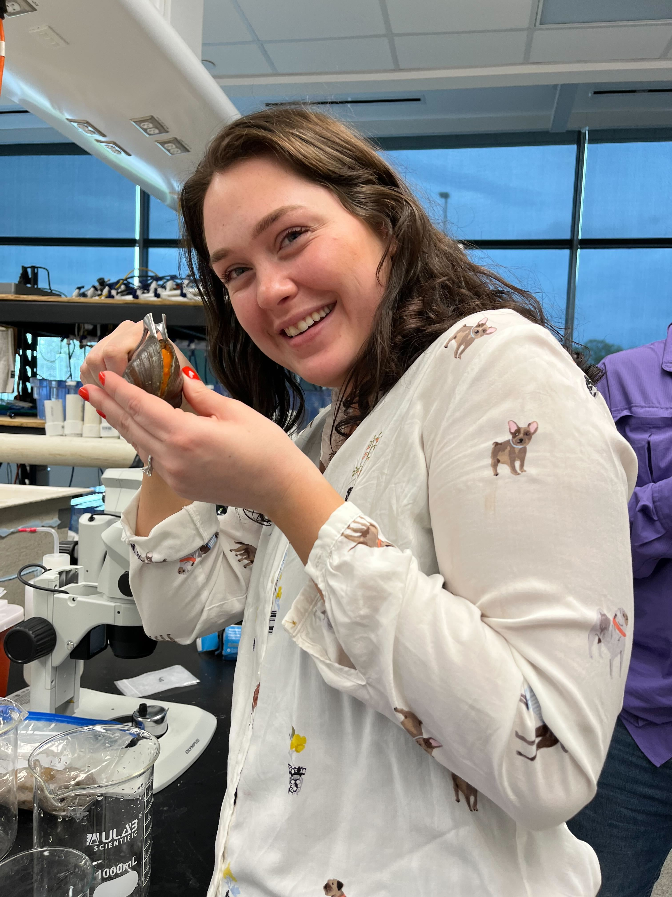
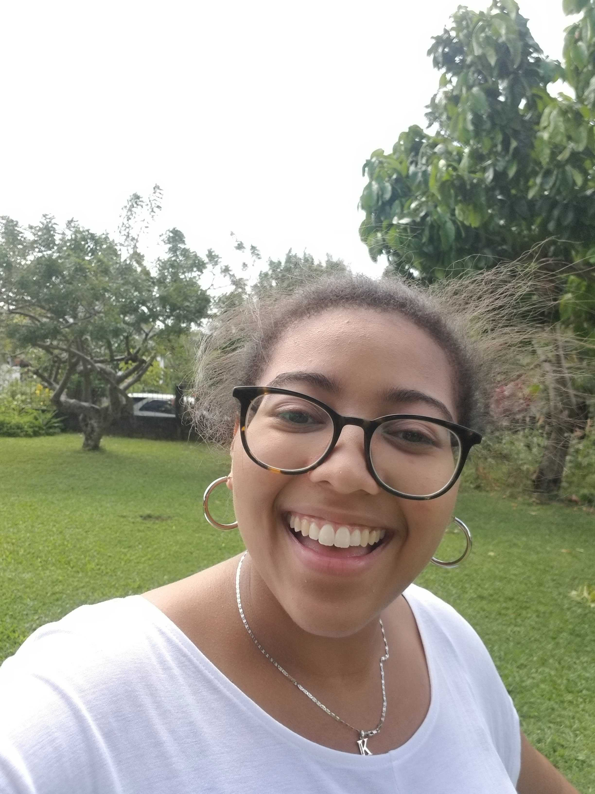
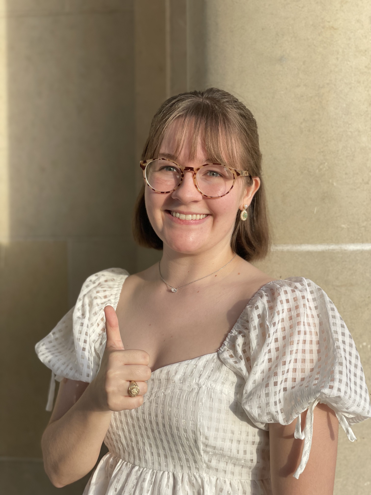
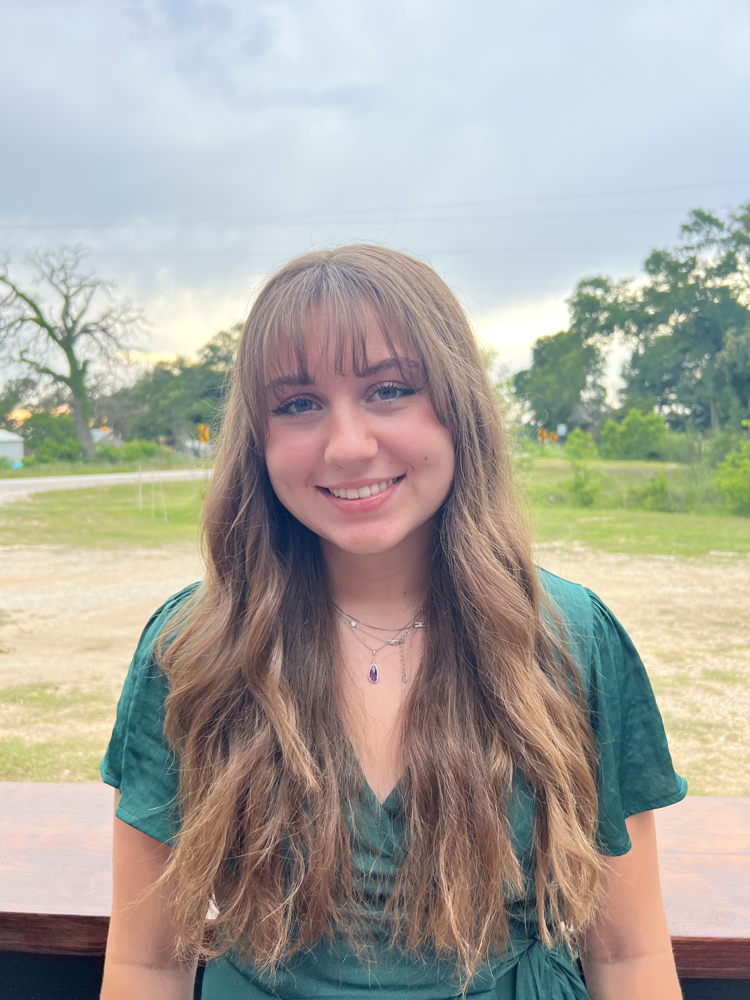
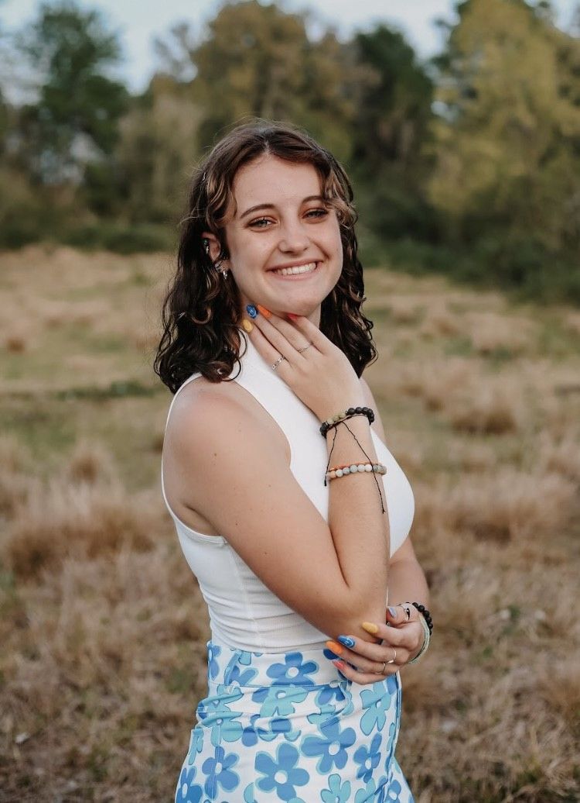
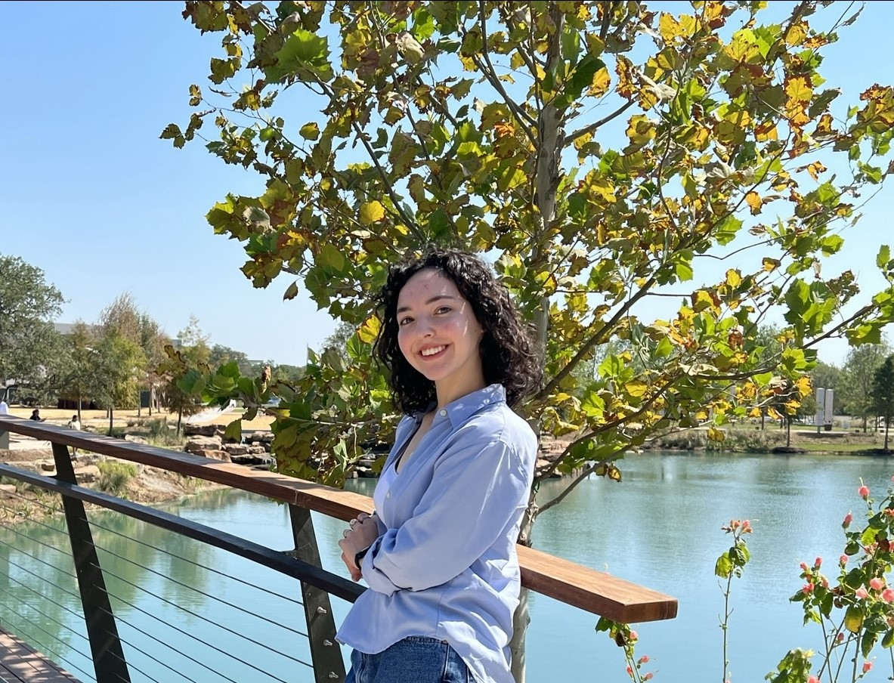
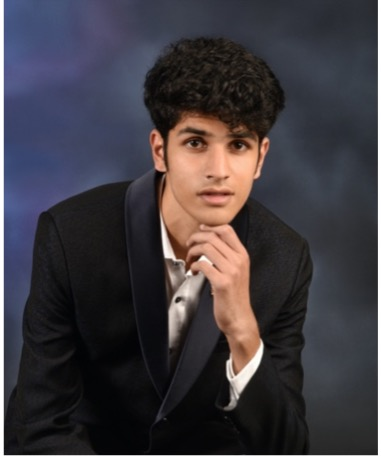
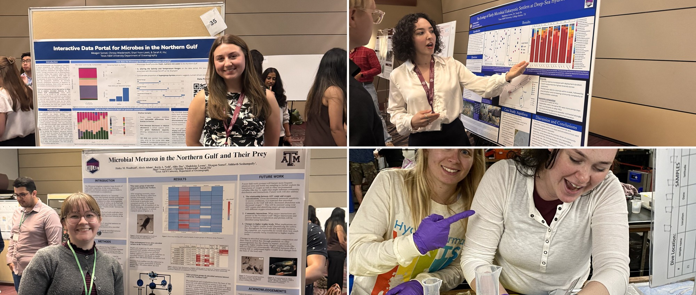

The lab is built on a shared love for the natural world. We combine field expeditions, wet-lab experiments, molecular methods, and computational biology.

{.banner fig-alt="Lab members on deck with ROV Jason, around the lab meeting table, at a holiday gathering, and at sea."}

## Principal investigator

:::: person-lead

::: lead-body
#### Dr. Sarah K Hu

[Assistant Professor]{.role}

[skhu \[at\] tamu.edu · she/her · [cv](products/cv.pdf)]{.contact}

I am a microbial ecologist devoted to figuring out what the weird marine microeukaryotes are doing in the ocean. Our work combines field expeditions, wet-lab experiments, molecular methods, and computational biology to address questions about the ecological roles microorganisms play in the ecosystem.

I'm most excited about research in the deep sea, especially biologically rich habitats like hydrothermal vents. I love teaching and mentoring about all things biological oceanography, coding, and more.
:::
::::

## Graduate students

:::::::::: person-grid
::: person

#### Alexis Adams

[PhD student]{.role}

[alexis98adams \[at\] tamu.edu · she/her]{.contact}

My name is Alexis and I am a PhD student here at Texas A&M! With a passion for understanding how ecological interactions impact the world around us I have dedicated myself to studying unicellular eukaryotes and their important role within the deep ocean. When I'm not working you can find me reading or playing my piano. I believe science should be a safe space for all and I am excited to explore the fascinating world of microbes!
:::

::: person

#### Kayla Nedd

[PhD student]{.role}

[knedd \[at\] tamu.edu · she/her]{.contact}

My name is Kayla Nedd. I joined the Hu lab in the summer of 2023 as a PhD student. My research interests are microbial ecology in extreme environments. I would like to understand what allows these microbes to be so well equipped to handle the intense conditions of the deep sea. In 2023, I participated in my first research cruise to Axial Seamount, an underwater volcano, to study protists in deep-sea hydrothermal vents. I am thrilled to delve further into my research and better understand this truly magnificent aspect of our planet.
:::

::: person

#### Hailey Woodward

[PhD student]{.role}

[haileymwwd \[at\] tamu.edu · she/her]{.contact}

My name is Hailey and I am excited to be back at A&M as a PhD student after receiving my Bachelors in Microbiology in 2023. I love all things microbiology, especially marine microbes, what they get up to, and their interactions with other organisms in the ocean over time. As a first-gen, low-income student, I hope to encourage students with a background like mine to pursue science and research! In my free time, I love to read and knit, often at the same time.
:::

:::: person
::: placeholder-img
HEADSHOT NEEDED\
Maria\
square crop, ≥600 × 600 px\
save as images/headshots/maria.jpg
:::

#### Maria

[Role TBD]{.role}

[TBD]{.contact}

*Bio to be added.*
::::

:::: person
::: placeholder-img
HEADSHOT NEEDED\
Hana\
square crop, ≥600 × 600 px\
save as images/headshots/hana.jpg
:::

#### Hana

[Role TBD]{.role}

[TBD]{.contact}

*Bio to be added.*
::::
::::::::::

## Undergraduate researchers

:::: person-grid
::: person

#### Meagan Sonsel

[Research assistant]{.role}

[she/her]{.contact}

Meagan Sonsel graduated with a degree in Environmental Geoscience with a concentration in biosphere, and continues to work in the lab on microbial eukaryotes in the deep sea.
:::
::::

## Lab alumni

:::::: alumni-grid
::: person

##### Abby Day

[Undergraduate researcher]{.role}

[Environmental Geoscience, B.S.]{.contact}
:::

::: person

##### Madeleine Lerma

[Undergraduate researcher]{.role}

[Zoology, B.S.]{.contact}
:::

::: person

##### Siddarth Seshampally

[Undergraduate researcher]{.role}

[Oceanography]{.contact}
:::
::::::

{.figure-wide}

## Join us

\
**I do not currently have any open positions for Masters, PhD, or Postdoctoral positions.** Watch this space for future opportunities.

#### PhD opportunities

[How do I apply?](https://ocean.tamu.edu/graduate-students/ms-phd-oceanography/ms-phd-information/index.html)

- [Texas A&M Graduate program](https://ocean.tamu.edu/academics/graduate-programs/index.html) \| Apply before January 1

- [NSF GRFP](https://www.nsfgrfp.org) \| Deadline: mid-October

- [Simons Graduate Fellowship in Ecology & Evolution](https://www.simonsfoundation.org/grant/simons-graduate-fellowships-in-ecology-and-evolution/) \| Deadline: July

#### Undergraduate opportunities

- If you are a current TAMU undergraduate, contact me directly for the potential to join.

- [REU program at TAMU](https://oceanography.tamu.edu/academics/reu/index.html) \| Deadline: February

#### Postdoctoral opportunities

- [NSF Ocean Sciences Postdoctoral Research Fellowships](https://www.nsf.gov/pubs/2021/nsf21538/nsf21538.htm) \| Deadline: May & November

- [C-COMP Postdoctoral Fellows](https://ccomp-stc.org/education-diversity/graduate-students-and-postdoctoral-researchers/) \| Deadline: mid-April

- [Simons Foundation Postdoctoral Fellowship in Marine Microbial Ecology](https://www.simonsfoundation.org/grant/simons-postdoctoral-fellowships-in-marine-microbial-ecology/) \| Deadline: mid-May
