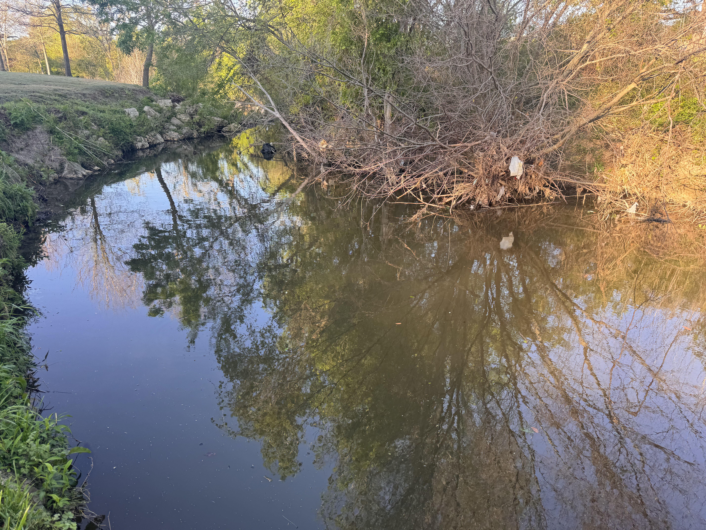

Protists are single-celled microbial eukaryotes that occupy the center of marine food webs as primary producers, consumers, mixotrophs (combined phototrophic and heterotrophic nutrition), and partners in mutualistic or parasitic associations. The diversity of these trophic strategies makes them key players in marine food webs. Functional groups with heterotrophic or mixotrophic nutrition have been the most overlooked, particularly in *in situ* studies.

## Questions

- How does microbial eukaryotic community diversity change over time and space?

- What environmental features have the largest impact on protistan community composition?

- What is the role of the microbial rare biosphere in marine habitats?

## San Pedro Ocean Time-series

The *S*an *P*edro *O*cean *T*ime-series (SPOT) station is located about half way between the Port of Los Angeles and Santa Catalina Island. [SPOT](https://dornsife.usc.edu/spot/) is part of the Wrigley Institute at the University of Southern California; the station has been visited, sampled, and studied monthly for over 15 years. As a PhD student, one of my main roles was the monthly sampling, which let me contribute to a long-term effort and ask my own research questions with the scientific and logistical support of the station.

Each month we conducted CTD casts to obtain oceanographic measurements from the surface to just above the bottom (\~880 m), and collected seawater at the surface, deep chlorophyll maximum, oxycline (\~150 m), and hypoxic depth (\~880 m). Monthly collection resolves seasonal and annual trends in microbial species richness and relative abundance.

{.figure-wide}

### Findings from SPOT

Naturally-occurring transition zones, such as nutriclines or oxyclines (where oxygen decreases sharply), attract microorganisms; microbial species richness, abundance, and activity all increase at these sites. Microorganisms that consume other microbes, including protistan heterotrophs, are in turn drawn to the available prey.

::: column-margin
> Microeukaryotic community diversity and metabolic activity peak at the oxycline
:::

DNA-based observations had shown heterotrophic species present throughout the water column, with a relative increase in species number at the oxycline. In a [2016 paper](https://academic.oup.com/femsec/article/92/4/fiw050/2197988), we used paired RNA and DNA tag-sequencing to test whether the two templates give different survey results, and whether the approach can be used to infer metabolic activity.

To access the metabolically-active component of the protistan community at SPOT, we [applied metatranscriptomics](https://sfamjournals.onlinelibrary.wiley.com/doi/abs/10.1111/1462-2920.14259). We extracted total RNA from each depth, then isolated and sequenced the messenger RNA. Matching mRNA sequences against reference transcriptome databases annotates both taxonomic origin and gene identity. For metabolically diverse protists, this brings us closer to characterizing trophic mode and taxonomic identity at once. Known heterotrophic taxa such as ciliates shifted distinctly at the oxycline, with a relative increase in transcripts related to fatty acid breakdown. Taxa known to be mixotrophic, such as haptophytes, had distinct transcript profiles in the euphotic and sub-euphotic zones. Transcripts associated with phototrophy were higher at the surface than transcripts associated with heterotrophic nutrition at depths without sunlight.

## Station ALOHA

The [Hawaii Ocean Time-series (HOT)](http://aco-ssds.soest.hawaii.edu/ALOHA/) samples Station ALOHA (A Long-Term Oligotrophic Habitat Assessment) monthly, and has been running for over 30 years. Through the Simons Foundation-funded SCOPE collaboration, I took part in several cruises to Station ALOHA. This let us study the oligotrophic North Pacific Subtropical Gyre and compare our findings and methods against the coastal California ecosystem.

{.figure-wide}

For one field season we conducted high-resolution diel sampling, following a parcel of water and sampling every 4 hours. This captured daily fluctuations in microbial community dynamics: species composition, microbe-microbe interactions, grazing activity, and how microbial photosynthetic machinery operates on an hourly time scale.

::: column-margin
> Species-specific nutritional needs drive temporal niche partitioning among protistan primary producers and consumers.
:::

## TAMU Gardens in Focus

[TGIF](https://shu251.github.io/tamu-gardens-in-focus/tgif-home.html) is a newly launched (2026), undergraduate-led on-campus time series. To test new experiments, train mentees, and hold outreach activities, we sample White Creek monthly. We monitor creek temperature, chlorophyll a, creek microbial composition, and more! Use our data dashboard to track temperature changes and how they relate to local weather and creek discharge. 

{.figure-wide}